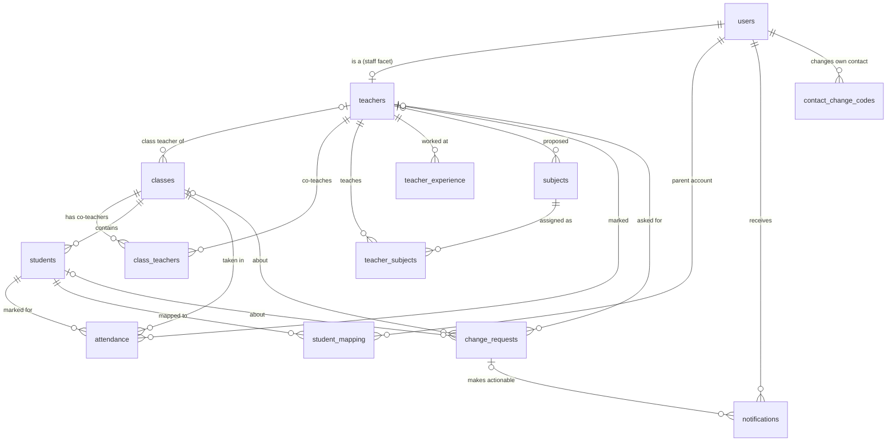
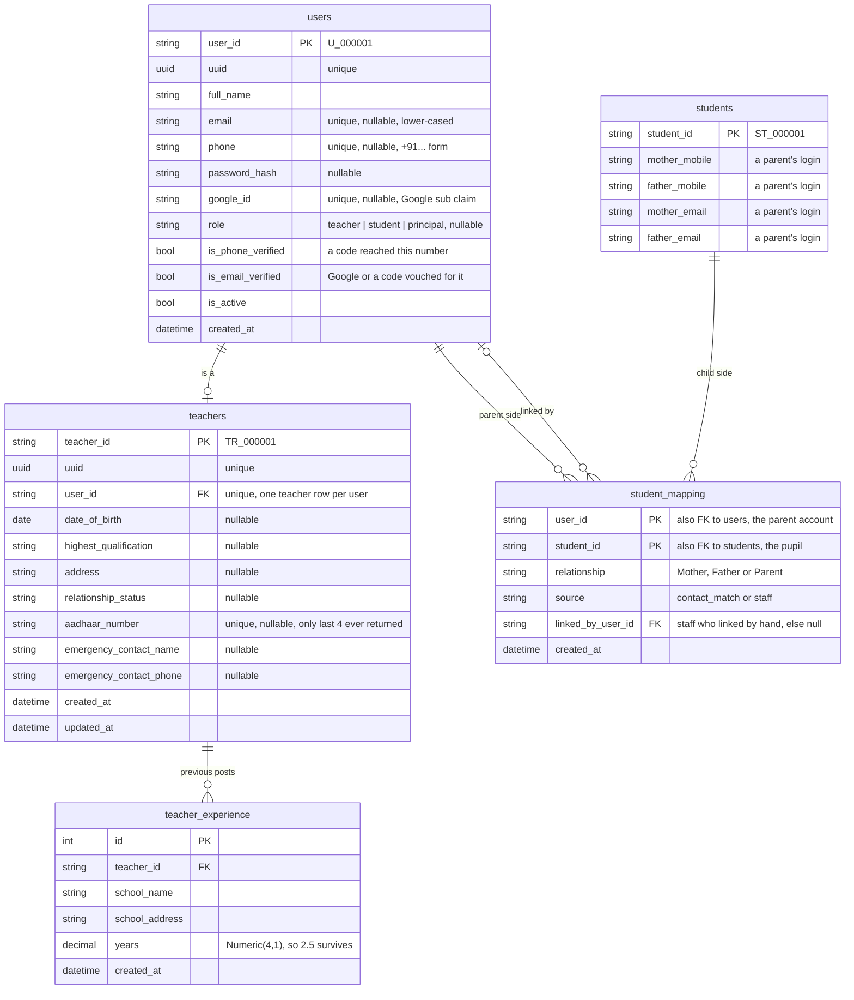
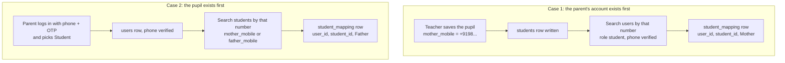
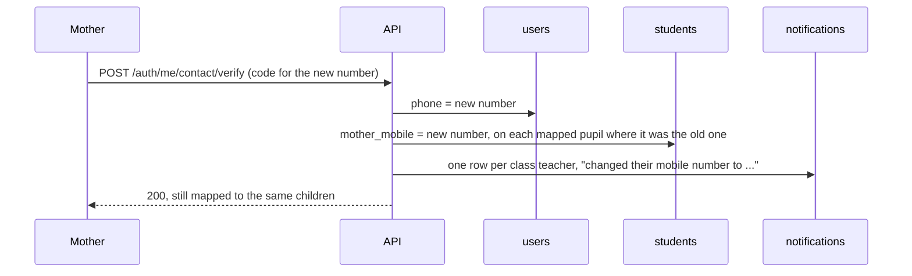
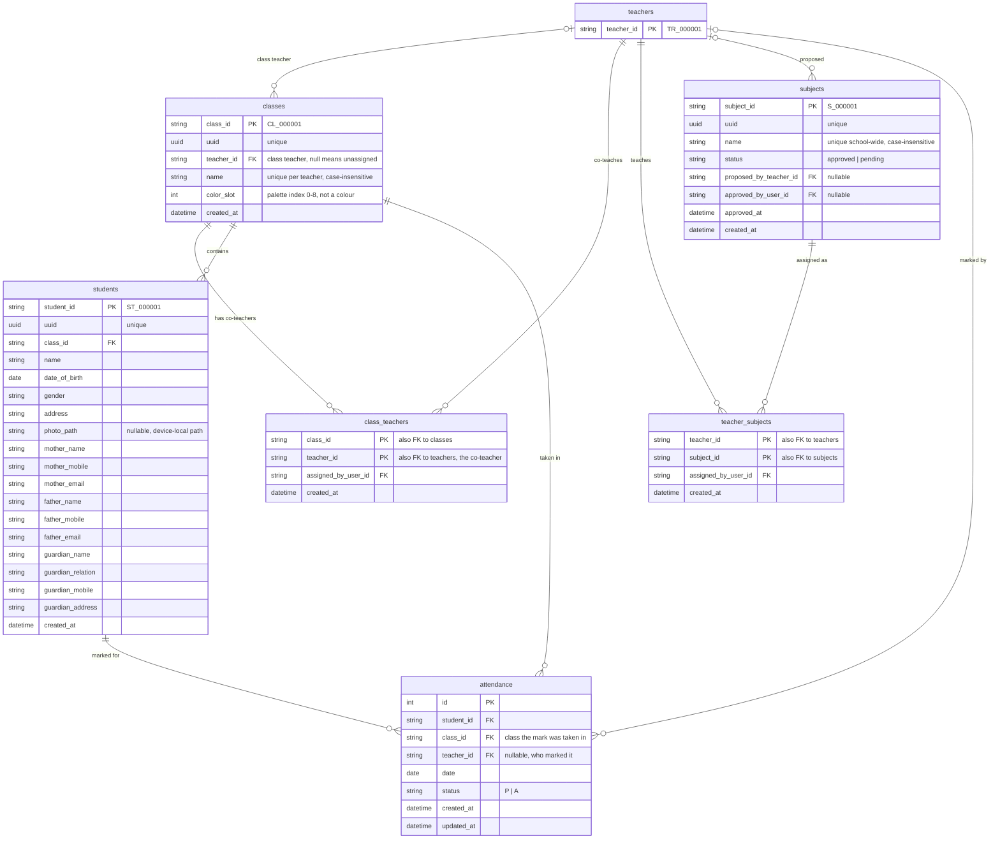
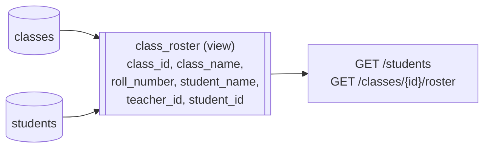
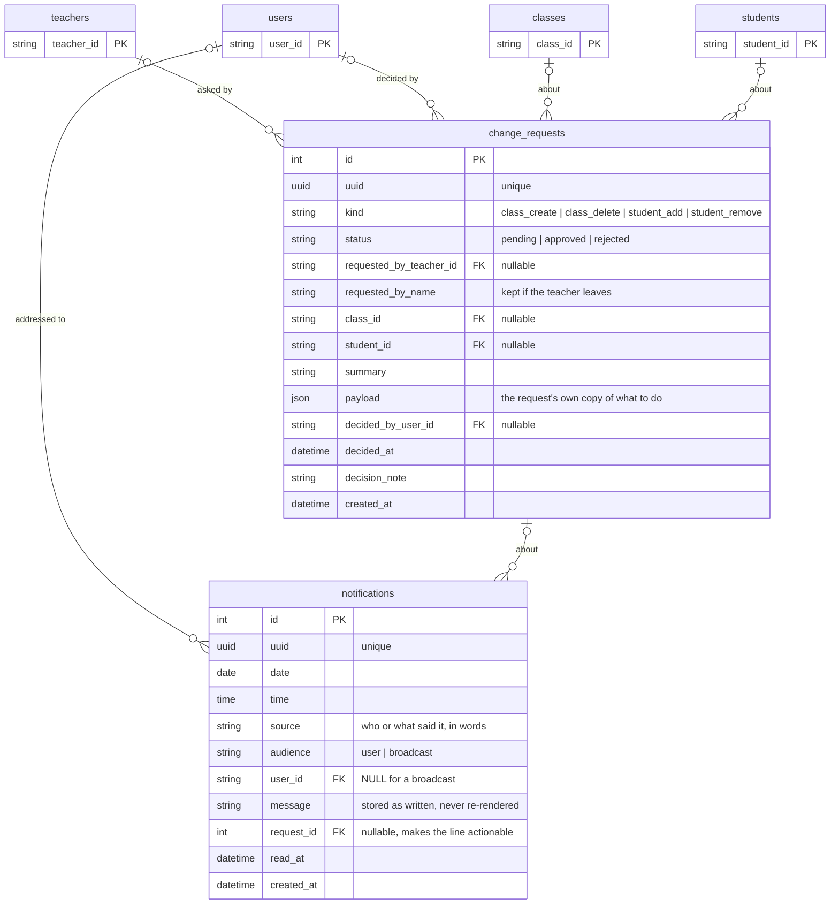
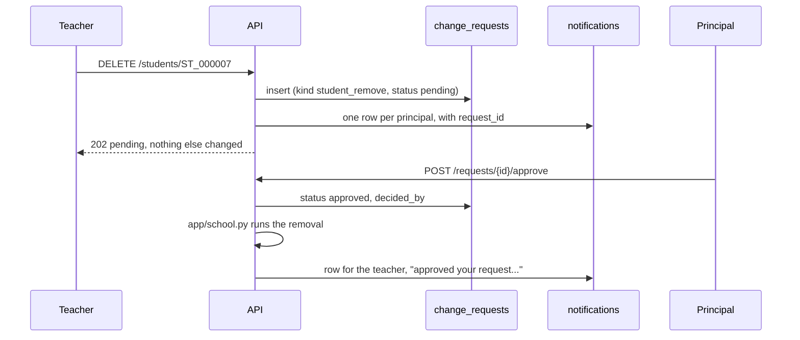
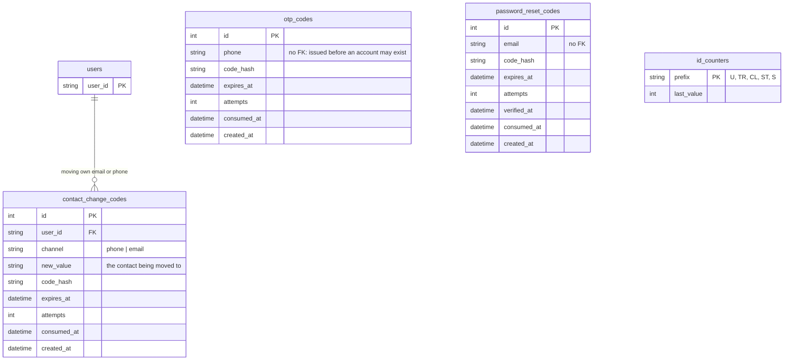
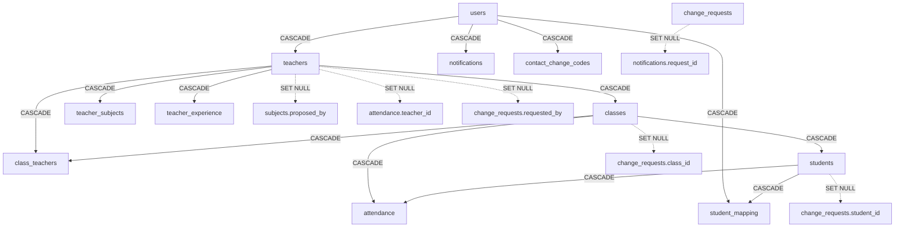

# GrowBuddy — Database Tables and Relations

PostgreSQL 18, schema owned by Alembic at revision **`0009`**. Drawn from
`backend/app/models.py` and `backend/app/database.py` on 2026-09-27. When a
migration changes a table, update this file in the same pass.

17 tables and 1 view. The diagrams are split by area because one diagram with
every table and every foreign key is unreadable; the overview comes first.

**Reading the diagrams:**

- `||--o{` one to many, `||--o|` one to zero-or-one, `|o--o{` optional parent
  (the foreign key is nullable).
- `PK` primary key, `FK` foreign key. Unique columns, and a key that is also
  a foreign key, are noted in the column's comment instead: older Mermaid
  builds (as bundled in some editors) reject `UK` and `PK, FK`.
- Readable ids (`U_000001`, `TR_…`, `CL_…`, `ST_…`, `S_…`) are handed out by
  `id_counters`; every such table also carries a random `uuid`.

---

## 1. Overview

Every table and how they connect. Columns are in the sections below.

Refer the diagram below

Standalone, with no foreign keys: `id_counters`, `otp_codes`,
`password_reset_codes`. The two code tables key off a bare phone or email
because a code is often issued before the account exists.

---

## 2. People — accounts, staff and parents

One `users` row per person who signs in, whatever their role. A teacher also
has a `teachers` row; a principal and a parent do not. A parent reaches a
pupil **only** through `student_mapping` (called `student_guardians` before
migration `0008`).

**Name and phone are not copied onto `teachers`.** They are joined in from
`users`, so a profile can never disagree with the account it logs in with.

### How a parent's login maps to a pupil

The mother's and father's mobile numbers and emails the teacher types on the
register-student form **are the parents' logins**. A parent account
(`role = student`) whose **verified** phone or email equals one of them gets a
`student_mapping` row for that pupil, as Mother or Father (`source =
contact_match`). It works whichever side exists first:

- **Verified only.** An OTP login proves a phone. Google sign-in or a confirmed
  email change proves an email. A number typed into the password sign-up form
  proves nothing, so it maps nothing until that account logs in once with OTP.
  Without this rule, anyone could type a mother's number and read her child's
  record.
- **Separate accounts, same children.** The mother's and father's accounts
  each get their own row for the pupil, and one account gets a row for every
  pupil carrying its number.
- **Recomputed, not frozen.** Automatic rows follow the record. If the teacher
  changes a number, the account it used to match loses the pupil and the new
  one gains it. Rows staff add by hand (`source = staff`) are never removed
  automatically.

When a **parent** changes their own number (after confirming it with a code),
the new number goes onto `users` and onto every mapped pupil's record where the
old one was, and the class teachers are told:

---

## 3. School — classes, pupils, subjects and attendance

Things the diagram cannot show:

- **A teacher's classes are two halves:** the ones they own
  (`classes.teacher_id`) plus the ones in `class_teachers`.
  `app.access.teacher_class_ids` is the one place that unions them.
- **No roll-number column.** Roll numbers follow registration order within a
  class and are computed on every read by the `class_roster` view (below).
- **Phone numbers are stored as `+91XXXXXXXXXX`** on both `users` and
  `students`, however they were typed. That is what lets a parent's login
  match the number on their child's record.
- **Duplicate pupil rule:** the unique index `uq_students_same_child` covers
  class + name + date of birth + address + both parents' names, emails and
  mobiles. The name is in it so that twins are two pupils.
- **One mark per pupil per day:** `uq_attendance_student_date` on
  `(student_id, date)`. Re-marking a day updates the row.

### The `class_roster` view

`roll_number` is the pupil's position in the class by registration order
(`student_id`, which is handed out in sequence and kept by a restored class
file). A new pupil gets the next number; removing one closes the gap behind
them. The view's current SQL is in migration `0009` (alphabetical before
that).
`class_roster.teacher_id` is the class **owner** only, so it must not be used
to decide what a co-teacher can see.

---

## 4. Approvals and notifications

A teacher asking to create or delete a class, or to remove a pupil, writes a
`change_requests` row and changes nothing else. The principal's answer runs
the change. Every line in someone's notification tab is a `notifications`
row; a `request_id` on it is what puts Approve and Reject on that line.

Which acts need this path (as of 2026-09-27):

| Act              | Principal     | Teacher                                                    |
| ---------------- | ------------- | ---------------------------------------------------------- |
| Create a class   | done outright | request                                                    |
| Delete a class   | done outright | request                                                    |
| Register a pupil | done outright | done outright, principals notified                         |
| Edit a pupil     | done outright | done outright; mapped parents notified if a mobile changes |
| Remove a pupil   | done outright | request                                                    |

---

## 5. Sign-in codes and counters

- **`otp_codes`** is for phone login. A verified code signs in to (or creates)
  whichever account holds that number.
- **`contact_change_codes`** is kept separate for that reason. It is keyed to
  one `user_id` and can only move that user's contact; it can never sign
  anyone in.
- **`password_reset_codes`** exists, but no route uses it yet: password reset
  is UI only.
- **`id_counters`** holds one row per id prefix. Numbers are never reused,
  which is what lets a restored class file bring pupils back under their old
  `ST_` ids.

---

## What deleting a row takes with it

Most foreign keys are `ON DELETE CASCADE`. The `SET NULL` ones keep history
alive when a person or thing goes away.

Solid arrows delete the child rows; dotted arrows only blank the column.
Every `assigned_by_user_id`, `linked_by_user_id`, `approved_by_user_id` and
`decided_by_user_id` is also `SET NULL`.

**Deleting a pupil or a class in code also deletes the attendance and
`student_mapping` rows explicitly** (`app/school.py`). PostgreSQL would apply the cascades on its
own, but the test suite runs on SQLite, which ignores them unless each
connection turns them on.
